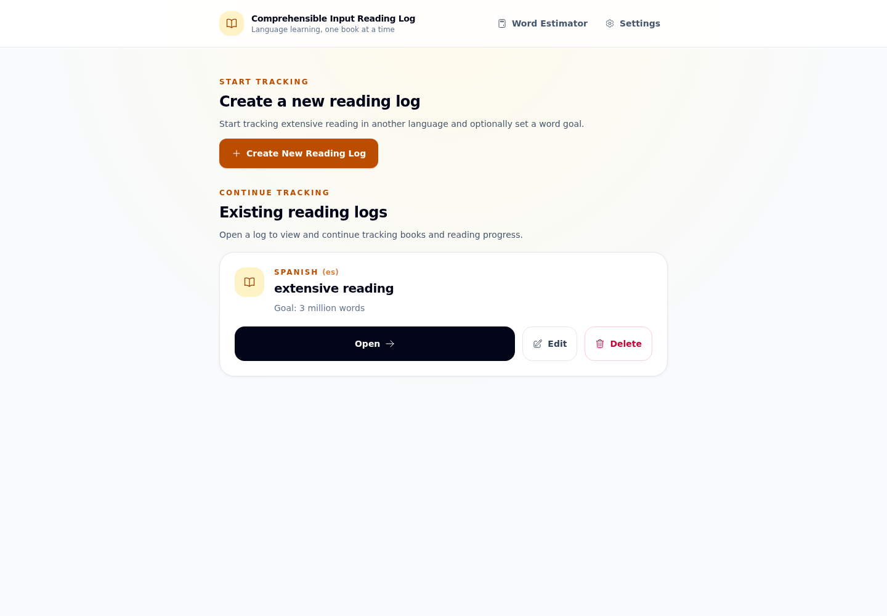
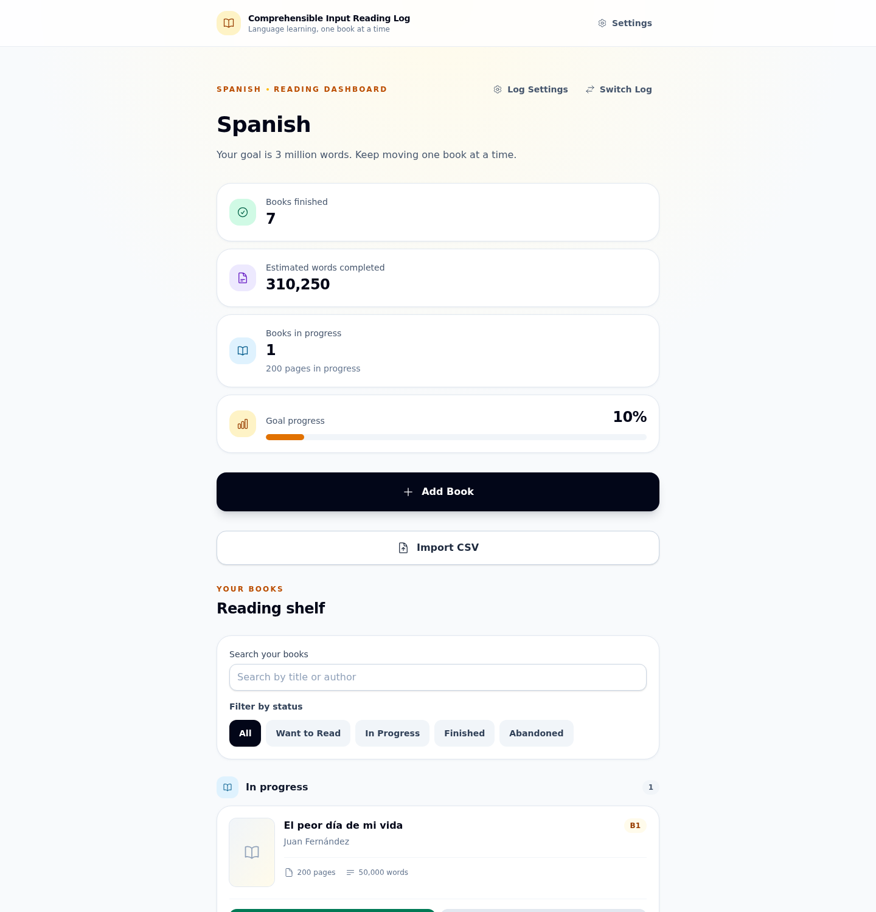
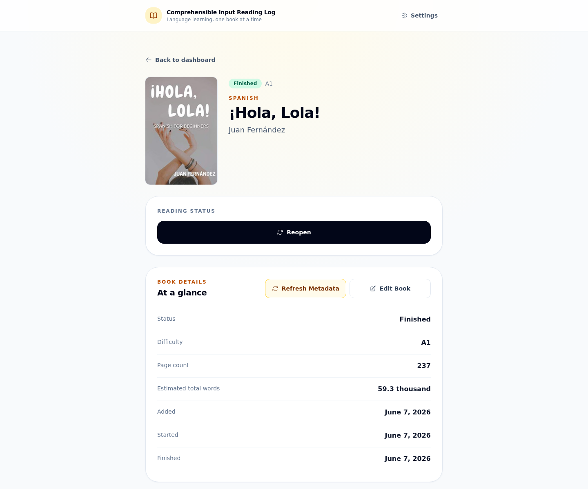

# CI Book Tracker

CI Book Tracker is a local-first reading tracker for language learners. It
organizes books into language-specific reading logs, tracks reading goals and
estimated words read, and keeps the data in a local SQLite database.

Manual entry works fully offline. Internet access is only needed for optional
book metadata and cover lookups.

## Why This Project Exists

Reading a large amount of understandable, interesting material can be a useful
part of learning a language. CI Book Tracker provides a simple way to keep a
personal record of that work without requiring an account or cloud service.

The application helps readers:

- Record books they want to read, are reading, or have completed
- Estimate the number of words they have read
- Set long-term reading goals for each language
- Review their progress over time
- Keep their reading history in a portable, user-owned database

## Extensive Reading and Comprehensible Input

Extensive reading generally means reading large quantities of relatively easy
and interesting material for meaning and enjoyment, rather than stopping to
study every unfamiliar detail. Many language learners use extensive reading as
one part of a comprehensible input approach to language acquisition.

These ideas inspired the project, but the application is simply a tracking
tool; it does not attempt to prove a particular theory of language learning.

Further background:

- [What is Extensive Reading?](https://erfoundation.org/wordpress/what_is/) from
  the Extensive Reading Foundation
- [Project inspiration video](https://www.youtube.com/watch?v=OheGJ2geFnA)

## Features

- Multiple language-specific reading logs
- Editable reading goals and estimated words-read totals
- Add, edit, view, and delete books
- Book status workflow:
  - Want to Read
  - In Progress
  - Finished
  - Abandoned
- Search and filtering within a reading log
- Optional metadata lookup and metadata refresh
- Optional cover lookup
- Bulk book import from CSV
- Standalone and book-form sample-based word count estimator
- Local SQLite storage
- Database export and restore
- Settings page with metadata provider configuration

## Metadata Providers

CI Book Tracker can search these optional providers:

- [Open Library](https://openlibrary.org/)
- [Google Books](https://books.google.com/)
- [Hardcover](https://hardcover.app/)

Open Library can be used without configuration. Google Books and Hardcover can
use credentials configured on the Settings page or through environment
variables. Availability and result quality depend on the provider.

Metadata lookup is an enhancement, not a requirement. Books can always be
entered and edited manually, and the rest of the application remains useful
without internet access.

## Word Count Estimator

The global header links to a standalone word count estimator that does not
require an active reading log. Paste a representative passage, enter how many
pages, Kindle locations, screens, chapters, or percentage points it covers,
and provide the corresponding total for the book.

The estimator counts the sample and scales it to an estimated total. Sample
text and results are not saved. The same estimator is available while adding
or editing a book, where its result can be applied directly to the book form.

## Philosophy

- Local-first and offline-capable
- No accounts
- No cloud dependency
- User-owned data
- Portable SQLite storage
- Manual entry as a first-class workflow
- Metadata as an optional convenience

See [`docs/prompts/00_philosophy.md`](docs/prompts/00_philosophy.md) for the
original project philosophy.

## Screenshots

### Reading Log Selection



### Reading Dashboard



### Book Details



## Development

Requirements:

- Elixir 1.15 or later
- Erlang/OTP supported by the installed Elixir version
- Phoenix 1.8
- SQLite development support required by `exqlite`
- Standard build tools for compiling dependencies

The repository's `.tool-versions` pins the recommended Elixir and Erlang/OTP
versions for `mise` or `asdf`. After installing either version manager, run its
install command from the project directory before running Mix tasks.

Install dependencies, prepare the database, and build the assets:

```sh
mix setup
```

Start the application:

```sh
mix phx.server
```

Visit [http://localhost:4000](http://localhost:4000). To run the server inside
IEx instead:

```sh
iex -S mix phx.server
```

Run the test suite:

```sh
mix test
```

Run the complete project check before committing:

```sh
mix precommit
```

For a maintainer-oriented overview of the domain, LiveViews, persistence,
metadata normalization, backup workflows, and final refactor decisions, see
[`docs/architecture.md`](docs/architecture.md).

## Data Storage

Reading logs, books, provider settings, and other application data are stored
in a local `reading_log.db` SQLite database:

| Platform | Default directory |
| --- | --- |
| Linux | `~/.local/share/reading_log/` |
| macOS | `~/Library/Application Support/reading_log/` |
| Windows | `%APPDATA%/reading_log/` |

Set `DATABASE_PATH` to use a different location:

```sh
DATABASE_PATH=/absolute/path/to/reading_log.db mix phx.server
```

The Settings page supports downloading a database export and restoring a
previously exported database. Keep regular backups somewhere separate from the
device running the application, especially before moving or replacing the
database file.

## Provider Configuration

Provider credentials can be entered on the Settings page. They can also be
provided at startup:

| Variable | Purpose |
| --- | --- |
| `GOOGLE_BOOKS_API_KEY` | Optional Google Books API key |
| `HARDCOVER_API_TOKEN` | Optional Hardcover bearer token |

Google Books may allow requests without a key, but unauthenticated quota is not
guaranteed. Hardcover remains disabled until a token is configured.

## Deployment Scope

CI Book Tracker currently has no authentication or multi-user isolation. It is
intended to run as a personal application on a trusted device or network. Do
not expose it to an untrusted network without adding suitable authentication
and authorization.

## Roadmap

Possible future work includes:

- Burrito packaging for easier desktop distribution
- Improved metadata provider coverage and matching
- Better word estimation tools
- Additional import options and quality-of-life improvements

## License

This project is licensed under the MIT License. See [LICENSE](LICENSE) for the
full text.
